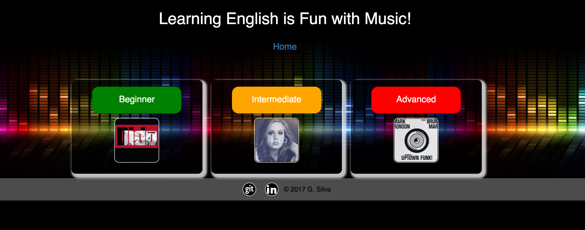
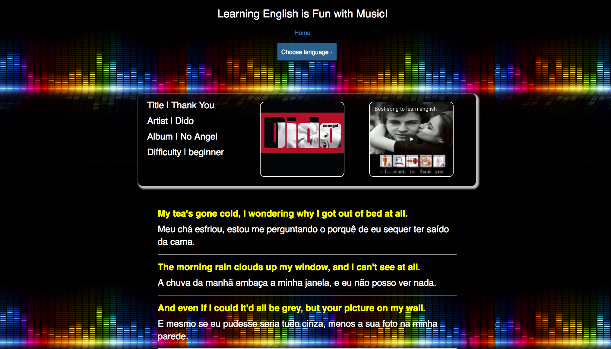

# [UXDI / WDI Collabotation Project](https://lit-harbor-76452.herokuapp.com/)

## Motivation

Help people interested in leaning English through songs lyrics.

## Team

* [Greice Silva](https://www.linkedin.com/in/greicesilva/)
* [Jamie Chow](https://www.linkedin.com/in/jamie-chow-16502511/)
* [Joshua Moon](https://www.linkedin.com/in/joshjmoon/)
* Julian Jensen

## Technologies

* Bootstrap
* Node.js
* Express
* Angular

##Screen Shots

## Ideas for future upgrade

* Spotify API integration
* Game to complete lyrics blank words to practice listening
* A vocabulary column
* Accept translation edits from users
